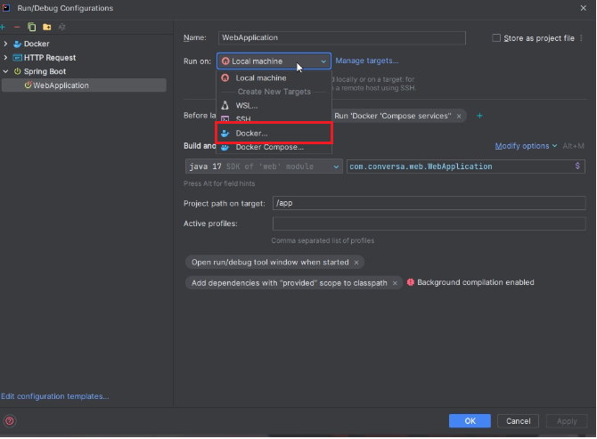
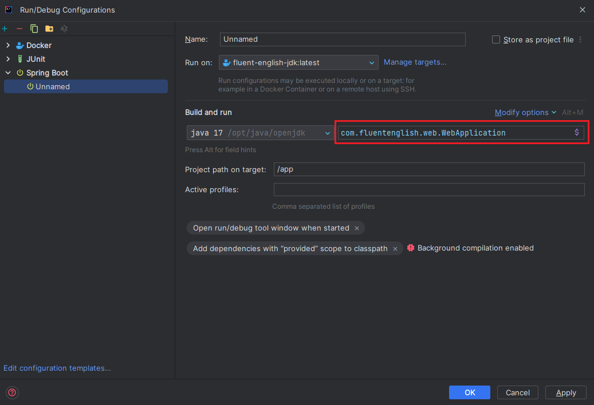

<span id="readme-top"></span>
<div style="text-align: center;">
   <h1 style="text-align: center;">Conversa Web</h1>
   <p style="text-align: center;">Web application for Conversa</p>
</div>

<!-- TABLE OF CONTENTS -->

## Table of Contents

1. [About The Application](#about-the-application)
2. [Getting Started](#getting-started)
    * [Prerequisites](#prerequisites)
    * [Installation](#installation)
    * [Run for development](#run-for-development)
        * [Run on IntelliJ IDEA (2023.1.1)](#run-on-intellij-idea-202311)

## About The Application

This is a web application for Conversa, you need to run the backend application to use this application for mobile

<!-- GETTING STARTED -->

## Getting Started

### Prerequisites

* Make sure that you have installed docker and docker-compose on your machine
* If you want to run the application on IntelliJ IDEA, make sure that you have installed docker plugin

### Installation

1. Clone the repo
   ```sh
   git clone https://github.com/Sang-Tan/Conversa
    ```
2. Open `Conversa/web` directory
3. Run docker compose
   ```sh
   docker-compose up
   ```
4. The application will be available at `http://localhost:8080`,
   you can change the port in `compose.yml` file

### Run for development

#### Run on IntelliJ IDEA (2023.1.1)

1. Open project in IntelliJ IDEA
2. Open menu `Run` -> `Edit Configurations...`
3. Click `+` button and select `Spring Boot`
4. In `Run on`, then select `Docker compose`


5. In `Configuration files` select `docker-dev.yml` file in
   project root directory
6. In `Service` select `appserver`


7. Click `Next`, wait for the service to
   be created then click `Next`, then click `Create`
8. Select main class



9. Select `+` button and select `Docker services`
10. Select `Compose files` as `docker-dev.yml` file in root directory
11. In `Sevices` select all services except `appserver`
12. Click `OK`
13. Return to spring boot configuration and click `modify options` -> `Add before launch` -> `Run another configuration`
14. Select the configuration created in step 9-12
15. Click `OK`, now you can run the application

