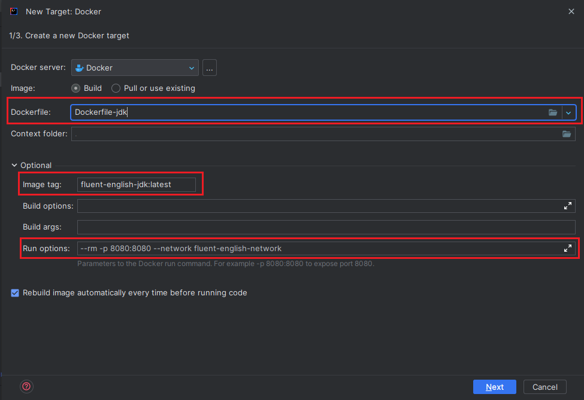
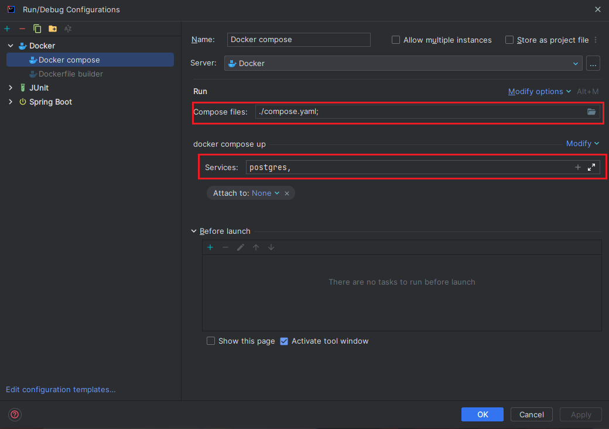

<span id="readme-top"></span>
<div style="text-align: center;">
   <h1 style="text-align: center;">Fluent English Web</h1>
   <p style="text-align: center;">Web application for Fluent English</p>
</div>

<!-- TABLE OF CONTENTS -->

## Table of Contents

1. [About The Application](#about-the-application)
2. [Getting Started](#getting-started)
    * [Prerequisites](#prerequisites)
    * [Installation](#installation)
        * [Configuration](#configuration)
        * [Run with docker compose](#run-with-docker-compose)
        * [Run on IntelliJ IDEA (2023.1.1)](#run-on-intellij-idea-202311)

## About The Application

This is a web application for Fluent English, you need to run the backend application to use this application for mobile

<!-- GETTING STARTED -->

## Getting Started

### Prerequisites

* Make sure that you have installed docker and docker-compose on your machine
* If you want to run the application on IntelliJ IDEA, make sure that you have installed docker plugin

### Installation

#### Configuration
1. Go to src/main/resources
2. Copy `application.example.properties` to `application.properties`
3. Configure the application properties

#### Run with docker compose

1. Clone the repo
   ```sh
   git clone https://github.com/Sang-Tan/Fluent-English
    ```
2. Open `Fluent-English/web` directory
3. Run docker compose
   ```sh
   docker-compose build
    ```
   ```sh
   docker-compose up
   ```
4. The application will be available at `http://localhost:8080`,
   you can change the port in `compose.yml` file

#### Run on IntelliJ IDEA (2023.1.1)

1. Open project in IntelliJ IDEA
2. Open menu `Run` -> `Edit Configurations...`
3. Click `+` button and select `Spring Boot`
4. In `Run on`, then select `Docker`


5. In `Dockerfile` select `Dockerfile-jdk` file in project root directory
6. Fill `Run options` with `--rm -p 8080:8080 --network fluent-english-network` 
7. Name the image `fluent-english-jdk:latest` or anything you want



8. Select main class


9. Select `+` button and select `Docker-compose`
10. Select `Compose files` as `compose.yml` file in root directory
11. In `Sevices` select all services except `appserver`
12. Click `OK`
13. Return to spring boot configuration and click `modify options` -> `Add before launch` -> `Run another configuration`
14. Select the configuration created in step 9-12
15. Click `OK`, now you can run the application

